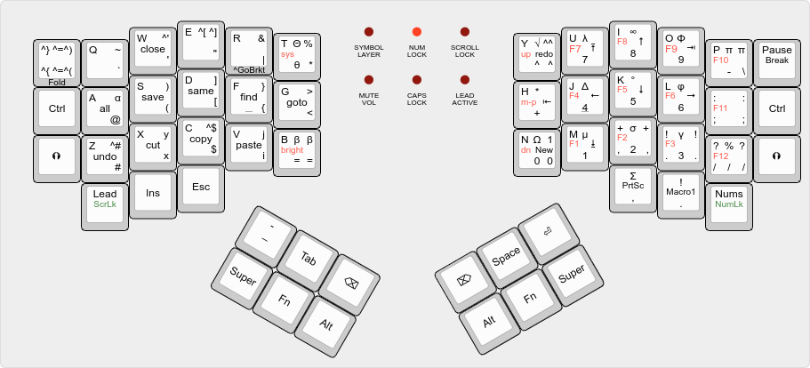

# The Dactyl ErgoCode Keyboard

This is a fork of the [Tom Short's ManuForm](https://github.com/tshort/dactyl-keyboard) keyboard, which itself is a fork of the [Dactyl](https://github.com/adereth/dactyl-keyboard), a parameterized, split-hand, concave, columnar, ergonomic keyboard. This work builds off of the ideas of the [ManuForm](https://github.com/jeffgran/ManuForm) by Jeff Gran with discussions on ([geekhack](https://geekhack.org/index.php?topic=46015.0)).

For additional background information about mechanical keyboard history and various parts and consideration check out the [Keyboard Information Doc](doc/).

## New Features & Updates

* Can have different row curvature for home columns vs. extra "reach" columns.
* Any column can have the last row keys (previously only middle and ring finger had them).
* Can utilize an optimization setting if column gap is too tight on last row keys.
* Additional thumb cluster options (see below).
* Parameters for how the thumb cluster attaches to main, useful if designing new thumb cluster.
* Can create more rows and more columns compared to previous versions.
* Allow for Cherry MX or more generic key switch hole.
* Expanded what settings are computed instead of hard-coded options requiring multiple edits.
* Overall improved parameterization, fewer setting assumptions & leveraging computed settings.
* Added more documentation on mechanical keyboards and key map layout.

## Thumb Cluster

For ergonomic keyboards of this design there is a desire to make better use of the thumb, giving it multiple keys to press instead of how a traditional keyboard only has a single space bar button to be used by one or both thumbs.
This fork introduced a new design for the keys pressed by the thumbs. This collection of extra keys for the thumbs has come to be referred to as the "Thumb Cluster" within the mechanical keyboard community.

Here we are introducing the Thumb Bowl design for the thumb cluster. This code also has an option for the Manuform thumb cluster design.

## Parameterized Settings

The keyboard is parameterized to allow adjusting the following:

* Rows: 4 - 6 (or more, or less)
* Columns: 4 and up
* Row curvature - Home columns
* Row curvature - Reach columns
* Column curvature
* Row tilt (tenting)
* Column tilt
* Column offsets
* Depth (raised off the table)
* Thumb cluster design style:
  * Manuform
  * Thumb-bowl
* Thumb cluster positioning & attachment points
  * useful if creating additional thumb cluster designs

For any given number of "rows" defined for any keyboard size only some of the columns in the main keys section will have that number of rows, so it better to think of the row number as the maximum number of keys a column could have. Frequently the "lastrow" (the row closest to the user) won't actually have a key for every column. For example if a keyboard is defined as having 4 rows, looking at it may seem more like a "keyboard with three rows, but an extra key at the bottom on some columns". Likewise some columns may be set to not have a first row key (at the top, furthest from the user). When describing a board size, the short hand should be in the format of RxC where R is the setting for the number or rows, and C is the setting for the number of columns (eg 4x6 is set to 4 rows and 6 columns, plus the thumb cluster keys, but depending on other settings it may appear to typically be 3 rows with a few bonus keys).

Currently the author is using heavily curved main board and heavily curved thumb clusters with the thumb-bowl design with 6 thumb buttons. On a 4x6 layout, all columns have a first row key, while only three columns (middle finger, ring finger, and home column pinkie) have a last row key. For the 5x6 layout, the settings are the same except there is no first-row-key for the non-home pinkie column (when the pinkie finger has to reach sideways for keys in that column).

* [Current Model](https://github.com/SeattleChris/dactyl-keyboard/blob/master/things/chris/right.stl)

Previously the 40% size (set as 4x5) and the 60% size (set as 5x6) models by Tom Short implement the Manuform thumb cluster design. The 40% version has a bit more tenting than the Dactyl. The Heavy Curve model (set as 5x5) is for those who want a deep bowl design for the See the following model files for configurations that may be most common:

* [40% size, (4x5)](https://github.com/SeattleChris/dactyl-keyboard/blob/master/things/right-4x5.stl)
* [60% size, (5x6)](https://github.com/SeattleChris/dactyl-keyboard/blob/master/things/right-5x6.stl)
* [Heavy Curve (5x5)](https://github.com/SeattleChris/dactyl-keyboard/blob/master/things/heavy-curve-5x5.stl)

## Features and Patches currently being worked on

[Current ToDo](src/dactyl_keyboard/todo.md)

## Setup & Assembly

### Setting up the Clojure environment

* [Install the Clojure runtime](https://clojure.org)
* [Install the Leiningen project manager](http://leiningen.org/)
* [Install OpenSCAD](http://www.openscad.org/)

### Generating a Design

* Run `lein repl`
* Load the file `(load-file "src/dactyl_keyboard/dactyl.clj")`
* This will regenerate the `things/*.scad` files
* Use OpenSCAD to open a `.scad` file.
* Make changes to design, repeat the above `load-file` command, OpenSCAD will watch for changes and rerender.
* When done, use OpenSCAD to export STL files

#### Tips

* [Example designing with clojure](http://adereth.github.io/blog/2014/04/09/3d-printing-with-clojure/)

### Printing

Pre-generated STL files are available in the [things/](things/) directory.
When a model is generated, it also generates a `.scad` model for a bottom plate.
This can be exported to a DXF file in OpenSCAD.
The [things/](things/) directory also has DXF files for the bottom plate.
When laser cut, some of the inside cuts will need to be removed.

This model can be tricky to print, depending on your 3D printer.

Printing with PLA on a Makerbot:
It's wide, so there were problems with edges warping.
This can cause the printer to think its head is jammed.
Even if it successfully prints, warping can cause problems.
On one print, the RJ-9 holder was squished, requiring cutting down the connector to fit.

Printing with Shapeways or other professional shops:
They probably won't have such difficulties.

Printing with PLA on a larger more robust 3D-printer:
Higher quality PLA helps with fewer tangles or print errors.
Larger print area means the print head doesn't have to go all the way to the edge.

### Build Notes

For guidance from previous versions, see the instructions for wiring and general build for the [original Dactyl](/guide/) and for [Tom Short's Manuform](/manuform/).

#### Wiring

Here are materials I expect to use for wiring.

* Two Arduino Pro Micros
* [Heat-set inserts](https://www.mcmaster.com/#94180a331/=16yfrx1)
* [M3 wafer-head screws, 5mm](http://www.metricscrews.us/index.php?main_page=product_info&cPath=155_185&products_id=455)
* [#30 wire](https://www.amazon.com/dp/B07BLZ333V/)
* [3-mm cast acrylic](http://www.mcmaster.com/#acrylic/=144mfom)
* [1N4148 diodes](https://www.amazon.com/gp/product/B00LQPY0Y0)
* [Female RJ-9 connectors](https://www.amazon.com/gp/product/B01HU7BVDU/)

Following the traditional approach, the row connections can be made soldering the legs of the diodes. The columns can be wired with a bare wire, or insulated wire stripped at the connection points.

The 3D printed part is the main keyboard.
You can attach a bottom plate with screws.
  The case has holes for heat-set inserts designed to hold 3- to 6-mm long M3 screws.
  Then use wafer-head screws to connect a bottom plate.
A bottom plate is technically optional, but can help clean things up and protect any dangling wires.
You need something on the bottom to keep the keyboard from sliding around such as a rubber pad (or PlastiDip the bottom).

This is how the rows/columns wire to the keys and the ProMicro

##### Alternative row-driven wiring diagram for ProMicro

NOTE: you also make sure the firmware is set up correctly (ex: change row pins with col pins)

#### Firmware

Firmware goes hand in hand with how you wire the circuit. Some firmware options include:

* Tom Short's adaptation of QMK firmware [here](https://github.com/tshort/qmk_firmware/tree/master/keyboards/dactyl-manuform). This allows each side to work separately or together, and shows connections for the Arduino Pro Micro controllers.
* Keyboard firmware in Python [here](https://github.com/KMKfw/kmk_firmware)

#### Key Map Layout

[Keyboard Layout Editor](http://www.keyboard-layout-editor.com) is useful for designing how you want to map your keys.

* [Ver 1](http://www.keyboard-layout-editor.com/#/gists/3d6424e0f58ad46f2020e55a03afcecd)
* [Ver 2](http://www.keyboard-layout-editor.com/#/gists/47ad964ab133479c8171956357e286ae)
* [Ver 3](http://www.keyboard-layout-editor.com/#/gists/fff42581cb3a5dbfca9aae3a7b00eabf)
* [Current Layout](http://www.keyboard-layout-editor.com/#/gists/6468df87b3a086a1736b0a34bdbe207f)

## License

Copyright © 2015-2020 Matthew Adereth, Tom Short, Chris L Chapman

The source code for generating the models (everything excluding the [things/](things/) and [resources/](resources/) directories is distributed under the [GNU AFFERO GENERAL PUBLIC LICENSE Version 3](LICENSE).  The generated models and PCB designs are distributed under the [Creative Commons Attribution-NonCommercial-ShareAlike License Version 3.0](LICENSE-models).
